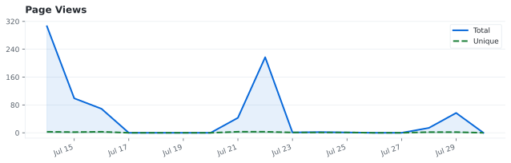
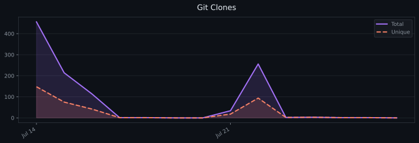
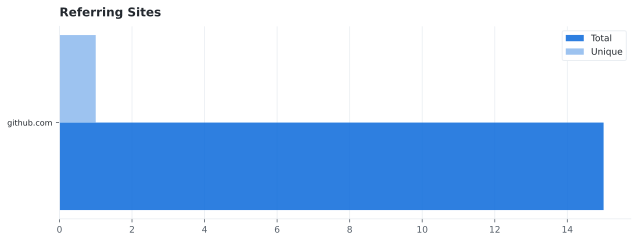
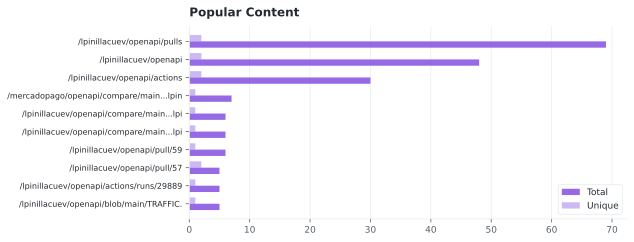

# Traffic

> Last updated: 2026-07-29 · Persisted daily via GitHub Actions · [Interactive dashboard](graphs/traffic/index.html)

## Page Views

## Git Clones

## Views & Clones — last 14 days

| Date | Views | Unique visitors | Clones | Unique cloners |
|------|------:|----------------:|-------:|---------------:|
| 2026-07-27 | 0 | 0 | 0 | 0 |
| 2026-07-26 | 0 | 0 | 1 | 1 |
| 2026-07-25 | 1 | 1 | 1 | 1 |
| 2026-07-24 | 2 | 1 | 3 | 3 |
| 2026-07-23 | 1 | 1 | 2 | 2 |
| 2026-07-22 | 217 | 3 | 256 | 94 |
| 2026-07-21 | 43 | 3 | 34 | 18 |
| 2026-07-20 | 0 | 0 | 0 | 0 |
| 2026-07-19 | 0 | 0 | 0 | 0 |
| 2026-07-18 | 0 | 0 | 1 | 1 |
| 2026-07-17 | 0 | 0 | 1 | 1 |
| 2026-07-16 | 69 | 3 | 114 | 42 |
| 2026-07-15 | 99 | 2 | 214 | 75 |
| 2026-07-14 | 306 | 3 | 456 | 148 |

## Referring Sites

| Source | Views | Unique |
|--------|------:|-------:|
| github.com | 32 | 1 |

## Popular Content

| Path | Views | Unique |
|------|------:|-------:|
| `/lpinillacuev/openapi/pulls` | 153 | 3 |
| `/lpinillacuev/openapi` | 87 | 2 |
| `/lpinillacuev/openapi/actions` | 61 | 3 |
| `/lpinillacuev/openapi/compare/main...lpinillacuev:openapi:feat/bot-workflows` | 27 | 1 |
| `/mercadopago/openapi/compare/main...lpinillacuev:openapi:main` | 23 | 1 |
| `/lpinillacuev/openapi/compare/main...lpinillacuev:openapi:main` | 21 | 1 |
| `/lpinillacuev/openapi/pull/33` | 9 | 2 |
| `/lpinillacuev/openapi/pull/45` | 6 | 3 |
| `/lpinillacuev/openapi/pull/27` | 6 | 1 |
| `/lpinillacuev/openapi/pull/59` | 6 | 1 |
